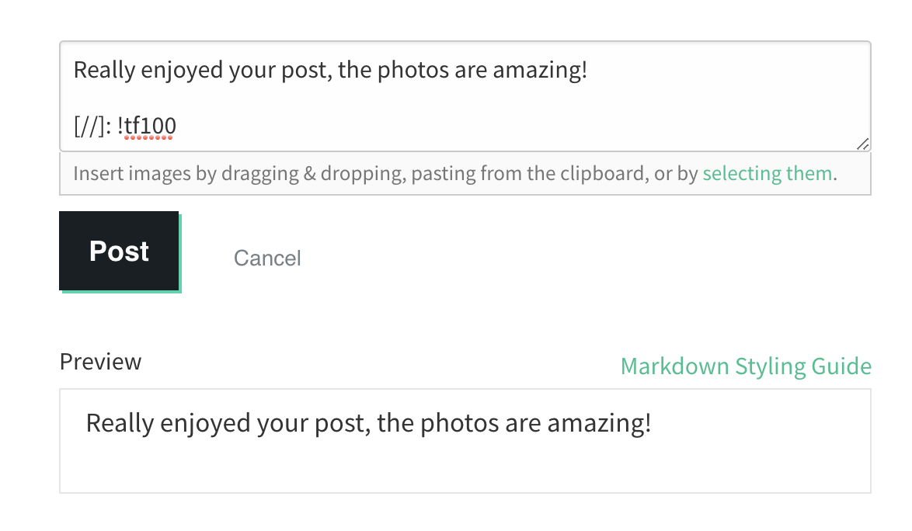
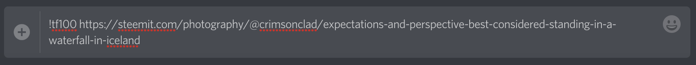
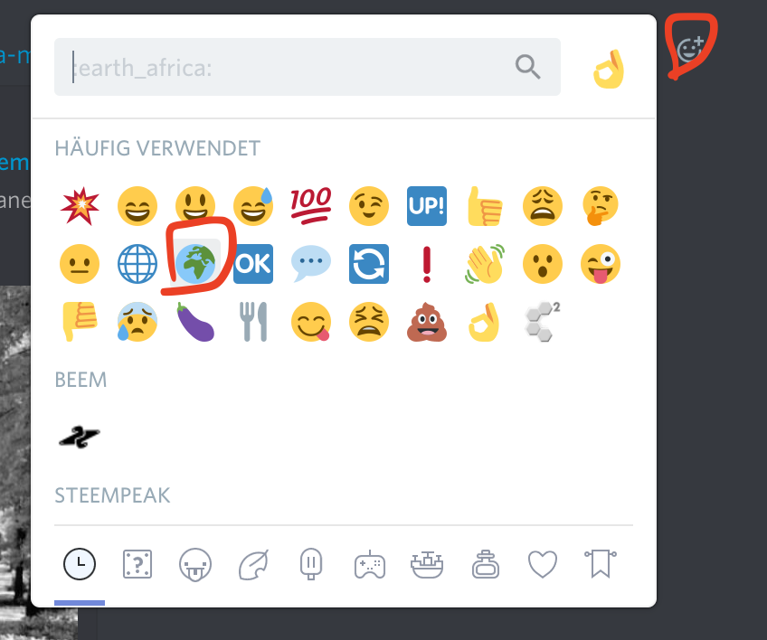
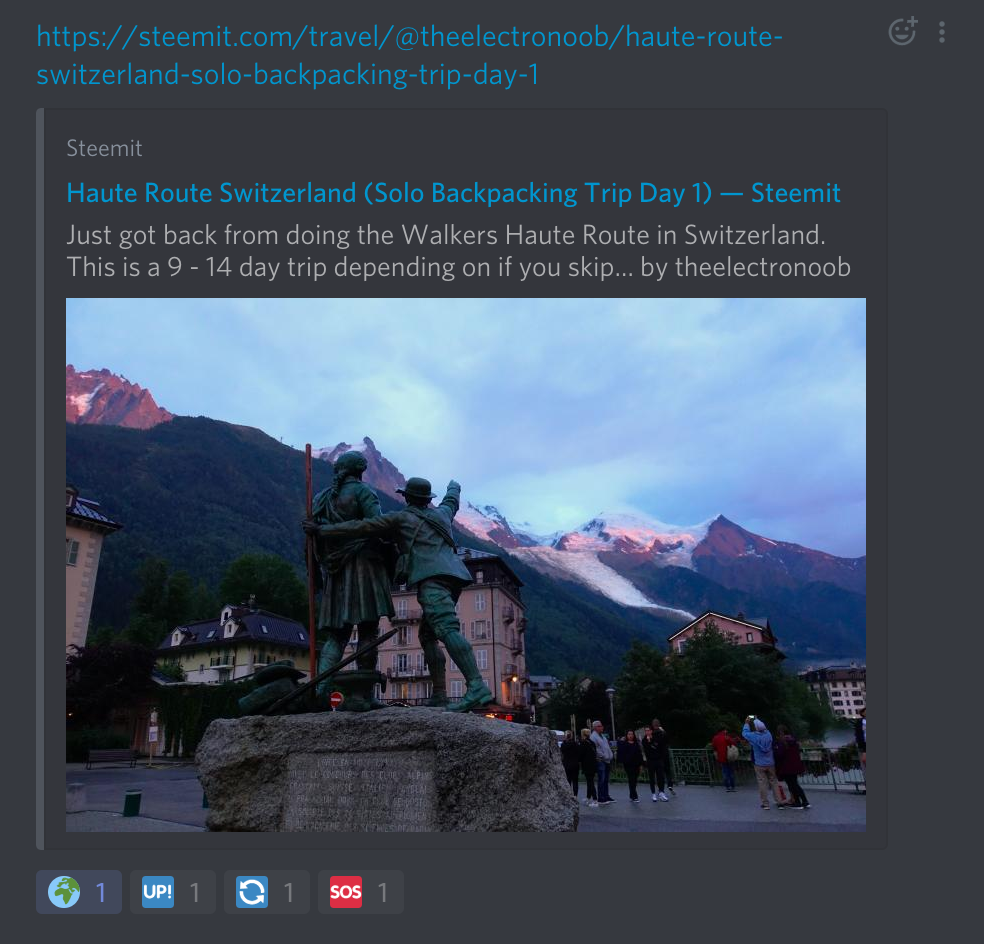
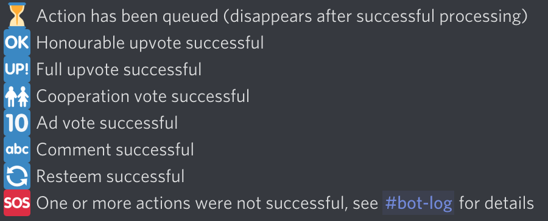

# Curating with the TravelFeed Curation Bot

For the TravelFeed curation, many routines are now automated. As a curator, you have the choice between three different ways of calling the bot to execute a curation routine. These are the available commands:

||||||
|--- |--- |--- |--- |--- |
|**Routine**|**Bot executes this**|**Steemit comment**|**Discord command**|**Discord reaction**|
|**Curate a post**|100% upvote + leaves comment + resteem|[//]: !tf100|!tf100|:earth_africa: `:earth_africa:`|
|**Honour a post**|50% upvote + leaves comment|[//]: !tf50|!tf50|:globe_with_meridians: `:globe_with_meridians:`|
|**Give cooperation upvote** (e.g. to @cyclefeed)|100% upvote|[//]: !coop100|!coop100|:busts_in_silhouette: `:busts_in_silhouette:`|
|**Advertisement upvote** for good travel posts not tagged with #travelfeed|10% upvote + leaves comment|[//]: !ad10|!ad10|:wave: `:wave:`|
|**Short post** that was not recognized by the bot|Leaves comment||!short0|:straight_ruler: `:straight_ruler:`|
|**Non-English post** that was not recognized by the bot|Leaves comment||!lang0|:gb: `:flag_gb:`|
|**Post that violates copyright** / does not list sources|Leaves comment||!copyright0|:pencil: `:pencil:`|

---

## 1. Steemit comment

This option is limited to fewer routines than the other two. Simply write a comment on Steemit below the post in question.

Only use these commands with your **personal account** and **not** when logged into @travelfeed!

This curation method encourages you to leave a personal comment for the author!

You can hide the commands by putting an empty paragraph in front of them and placing `[//]: ` in front of them:

## 2. Discord commands

These commands only work in the #bot-commands channel! Additionally to the table above, you can find all commands as a pinned message in #bot-commands.

Simply write the command followed by a whitespace and the link to the post and send the message:

Please make sure to continue reading "4. Understanding bot reactions" below!

## 3. Discord reaction

The bot automatically streams eligible posts to the channel #post-feed and posts possibly eligible for advertisement comments to #ad-feed. 

In these channels you can add reactions to the post links posted by the bot. Additionally to the table above, you can find all possible reactions as a pinned message in #post-feed and #ad-feed.

Please use the advertisement reaction :wave: only in #ad-feed and the other reactions only in #post-feed!

If you don't find the desired reaction on the top, you can search for it by typing the unique emoticon identifier from the table above in the reaction search bar (where it says `:earth_africa:` in the screenshot).

Please make sure to continue reading "4. Understanding bot reactions" below!

## 4. Understanding bot reactions

When you use a Discord command or a Discord reaction, the bot will automatically add reactions which looks like this:

It is important that you understand what these reactions mean:

**If you get a :sos: reaction you need to check which part(s) of the route were unsuccessful and need to do them manually on steemit!**

Additionally to here, you can find all possible bot reactions as a pinned message in #post-feed and #ad-feed.

## 5. More bot commands

The bot can also answer to a range of commands unrelated to executing curation routines:

`!rewards username` Shows how many upvotes the user *username* received from @TravelFeed within the past 7 days

`!payouts x` Fetch payout history for the past *x* days

`!mana` Get the current voting mana of @TravelFeed

`!location postlink` Shows the location of *postlink* if a steemitworldmap code snipped is provided in the post

`!getposts theme` Search the last 100 posts in #travelfeed for posts fitting the curation theme. Valid arguments for the option *theme* include: "Africa", "Oceania", "Australia", "australiaoceaniaafrica", "Asia", "Food", "foodoftheworld", "Europe", "America", "travel Advice", "traveladvice". Expect "foodoftheworld" and "traveladvice" to contain false positives.

## 6. Automated post categories (experimental)

Upvoted posts are automatically dropped in one of the post category channels ("Curated posts by category") based on location (steemitworldmap code snippet) or hotwords. You can search these channels to find posts for the curation post!